# ResumeAtlas — Analytics

> **Session rule:** Read all files in `/ai-context` before making product, copy, SEO, billing, or analytics changes.

**Provider:** Google Analytics 4 (GA4)  
**Client:** `app/lib/gtagClient.ts`  
**Event definitions:** `app/lib/analyticsEvents.ts`  
**Tracking helpers:** `app/lib/analyticsFunnel.ts`  
**Billing events:** `app/lib/billing/billingEventsClient.ts`

GA4 stub loaded in root `app/layout.tsx`.

---

## Conversion funnel (GA4 events)

One event name per step. Use `surface` / param dimensions — do not duplicate event names.

```mermaid
flowchart LR
  A[tool_page_viewed] --> B[analysis_clicked]
  B --> C[dashboard_generated]
  C --> D[post_dashboard_optimize_modal_viewed]
  D --> E[optimization_clicked]
  E --> F[auth_flow_started]
  F --> G[user_login]
  G --> H[payment_clicked]
  H --> I[purchase]
  I --> J[optimization_completed]
  J --> K[optimization_pdf_downloaded]
```



### Event reference

| Event | When fired | Key params | Dedup |
|-------|------------|------------|-------|
| `tool_page_viewed` | Workbench/tool page load | `page_path` | Once per session per path |
| `analysis_clicked` | User clicks Analyze | `user_state`: anonymous \| logged_in | Per submit |
| `dashboard_generated` | Successful analyze response | `evidence_match`, `user_state`, `jd_used`, `analysis_id` | Once per `analysis_id` |
| `post_dashboard_optimize_modal_viewed` | 5-min nudge shown | — | Once per analysis trigger |
| `optimization_clicked` | User clicks optimize CTA | `surface` (see below) | Debounced 1.2s |
| `optimize_prompt_dismissed` | User dismisses nudge/modal | `surface` | — |
| `auth_flow_started` | OAuth redirect begins | `auth_source`, flow id | Once per flow id |
| `user_login` | OAuth completes | `method: google`, `auth_source` | Once per flow id |
| `payment_clicked` | Razorpay checkout opens | `checkout_trigger`, `package_id`, `value_minor`, `currency`, `order_id` | Once per order id |
| `purchase` | Payment verified | `transaction_id`, `value`, `currency`, `credits_granted`, `checkout_trigger` | Once per payment id |
| `payment_failed` | Checkout failure | `reason` | — |
| `optimization_completed` | Optimize job finishes | `job_id`, `score_before`, `score_after`, `restored_from_cache` | Once per job id |
| `optimization_pdf_downloaded` | PDF blob downloaded | `surface` | — |

---

## Surface dimensions

### `optimization_clicked` surfaces

| Surface | Source |
|---------|--------|
| `intelligence_panel` | Dashboard optimize CTA |
| `score_row` | Score row CTA |
| `preview_banner` | Preview banner |
| `post_dashboard_nudge` | `OptimizeDashboardNudgeModal` |
| `oauth_return` | Post-login resume flow |
| `conversion_modal` | `OptimizeConversionModal` (disabled) |
| `conversion_modal_after_payment` | Post-payment conversion |
| `credit_modal_balance` | CreditPackModal with balance |
| `credit_modal_after_purchase` | CreditPackModal post-purchase |

### `auth_flow_started` / `user_login` sources

| Source | Trigger |
|--------|---------|
| `quota_modal` | `LimitModal` |
| `pricing_modal` | Credit pack / download modals |
| `conversion_modal` | Optimize conversion modal |
| `navbar` | Navbar sign-in |

### `checkout_trigger` surfaces

| Surface | Modal / gate |
|---------|--------------|
| `credit_pack_modal` | `CreditPackModal` |
| `optimize_download` | `DownloadPaymentModal` |
| `oauth_resume` | OAuth resume checkout |
| `conversion_modal` | `OptimizeConversionModal` |

### `optimization_pdf_downloaded` surfaces

| Surface | Context |
|---------|---------|
| `optimize_panel` | Direct download on `/optimize` |
| `payment_success_modal` | `DownloadPaymentSuccessModal` |

---

## Funnel correlation

**Session storage key:** `resumeatlas_active_funnel_id_v1`  
**Helper:** `app/lib/funnelTracking.ts` → `startNewFunnel()`

Ties analyze → optimize → download into one browser-session funnel for debugging and billing event context. Passed to modals as `funnelId` prop.

**Pending auth flow:** `app/lib/auth/pendingAuthFlow.ts`  
Tracks `auth_source` + funnel id across OAuth (15 min TTL).

---

## User state dimension

`user_state: "anonymous" | "logged_in"` — attached to analyze and dashboard events.

---

## Billing event logging

Separate from GA4 — server/client billing audit trail via `logBillingEvent()` in `billingEventsClient.ts`.

Examples: `billing_payment_modal_open`, checkout start, verify success.

---

## Dedup strategy

`analyticsFunnel.ts` uses `sessionStorage` prefix `resumeatlas_ga_once_v1_` to prevent double-counting in GA4 Explorations:

- Tool page views: once per path per session
- Dashboard: once per `analysis_id`
- Auth: once per flow id
- Payment: once per order/payment id
- Optimize complete: once per job id

---

## Product funnel stages (DB, not GA4)

Tracked in Supabase on `job_applications.state` and `credit_wallets.funnel_stage`:

```
analyzed → optimized → completed
```

| `applicationSource` | Meaning |
|---------------------|---------|
| `free` | Used free monthly scan |
| `pack` | Credit deducted at analyze |

Download gate applies when: `free` + `optimized` + `download_unlocked !== true`.

---

## What to measure (business questions)

| Question | Events / data |
|----------|---------------|
| SEO → tool arrival | `tool_page_viewed` by `page_path` |
| Scan completion rate | `analysis_clicked` → `dashboard_generated` |
| Nudge effectiveness | `post_dashboard_optimize_modal_viewed` → `optimization_clicked` (surface: `post_dashboard_nudge`) |
| Auth friction | `optimization_clicked` → `auth_flow_started` → `user_login` |
| Download conversion | `optimization_completed` → `payment_clicked` (surface: `optimize_download`) → `purchase` → `optimization_pdf_downloaded` |
| Revenue by package | `purchase` filtered by `package_id` (currently only `starter` in UI) |
| Free vs pack users | `user_state` + DB `applicationSource` |

---

## Known tracking gaps / notes

- `OptimizeConversionModal` is disabled — `conversion_modal` surfaces are rarely fired.
- Only `starter` pack in UI — `jobseeker` and `power` purchase events won't occur until UI enabled.
- Optimize nudge fires after **3 minutes** (`OPTIMIZE_NUDGE_DELAY_MS = 180_000`) — expect delay in `post_dashboard_optimize_modal_viewed`.
- DOCX download may not have a separate GA4 event — only `optimization_pdf_downloaded` is defined.

---

## Key files

| File | Purpose |
|------|---------|
| `app/lib/analyticsEvents.ts` | Event names + type definitions |
| `app/lib/analyticsFunnel.ts` | `track*` helper functions |
| `app/lib/gtagClient.ts` | `gtagEvent()` wrapper |
| `app/lib/funnelTracking.ts` | Funnel correlation ID |
| `app/lib/billing/billingEventsClient.ts` | Billing audit events |
| `app/layout.tsx` | GA4 script injection |
