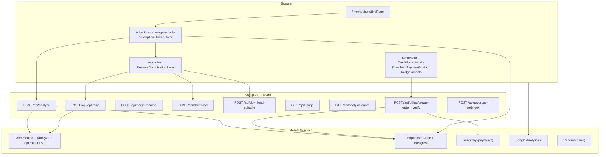
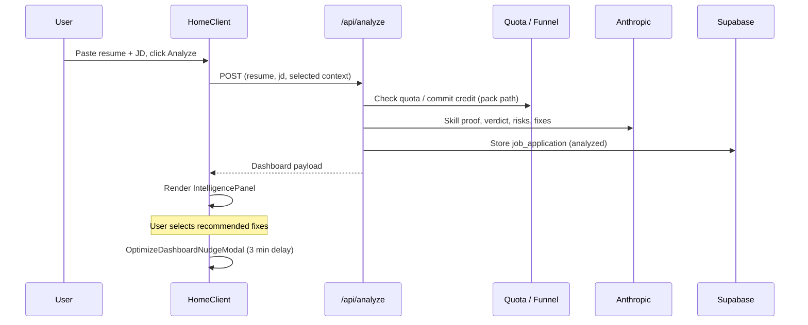
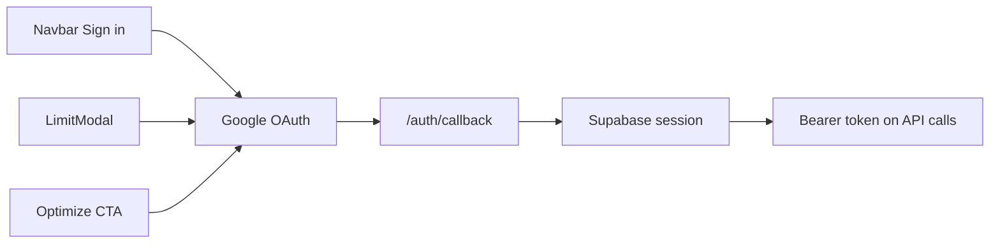
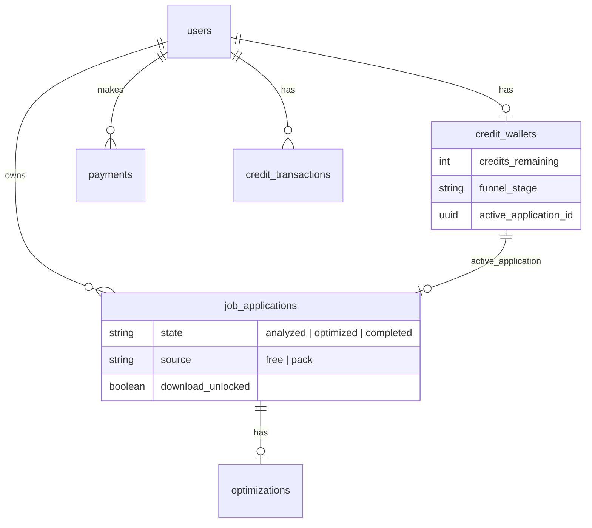

# ResumeAtlas — Architecture

> **Session rule:** Read all files in `/ai-context` before making product, copy, SEO, billing, or analytics changes.

---

## System overview



---

## Page architecture

| URL | Type | Component | Index |
|-----|------|-----------|-------|
| `/` | Marketing funnel | `HomeMarketingPage.tsx` | yes |
| `/check-resume-against-job-description` | **Primary workbench** | `HomeClient.tsx` | yes |
| `/ats-resume-checker` | SEO tool landing | `ATSResumeCheckerFreeLanding.tsx` | yes |
| `/resume-keyword-scanner` | SEO tool landing | `ResumeKeywordScannerLanding.tsx` | yes |
| `/optimize` | App workspace | `ResumeOptimizationPanel.tsx` | **noindex** |
| `/tools` | Internal link hub | — | **noindex** |
| `/{role}-resume-guide` etc. | Programmatic SEO | Various templates | yes |
| `/auth/callback` | OAuth callback | PKCE code exchange | — |

**Pattern:** One interactive workbench. Tool SEO pages are educational wrappers that CTA to the workbench anchor `#ats-checker-form`.

---

## Workbench modes (`HomeClient.tsx`)

Same component, different emphasis via props:

| Mode | `analysisMode` | JD required | Dashboard focus |
|------|----------------|-------------|-----------------|
| JD match (primary) | `jdMatch` | Yes | Full verdict + skill proof + fixes |
| ATS compliance | `atsCompliance` | Optional | Format/parsing signals |
| Keyword scanner | `keywordScanner` | Yes | Keyword coverage panel |

---

## Analysis pipeline



**Key libs:**
- `app/lib/jdMatch.ts` — JD matching
- `app/lib/atsAnalyze.ts` — ATS signals
- `app/lib/skillProofLlm.ts` — skill proof map
- `app/lib/applicationVerdict.ts` — verdict logic
- `app/lib/recommendedFixes.ts` — fix generation + validation
- `app/lib/enrichEvidenceDashboard.ts` — dashboard assembly

---

## Optimization pipeline

```mermaid
sequenceDiagram
  participant U as User
  participant HC as HomeClient
  participant Auth as Google OAuth
  participant Opt as /optimize
  participant API as /api/optimize
  participant LLM as Anthropic

  U->>HC: Select fixes + click Optimize
  alt Not logged in
    HC->>Auth: OAuth (preserve analyzer snapshot)
    Auth->>HC: Return with optimizerFlow=optimize
  end
  HC->>Opt: Navigate with selected fixes
  Opt->>API: POST (resume, jd, fixes, weak keywords)
  API->>LLM: REWRITE_EVIDENCE_RULES + user-selected fixes
  API-->>Opt: Structured resume JSON
  Opt->>Opt: Editable preview (StructuredResume)
  U->>Opt: Edit bullets / summary
  alt Free path
    U->>Opt: Download → DownloadPaymentModal
  else Pack path
    U->>Opt: Download PDF + DOCX directly
  end
```

**Optimize applies:**
1. JD-tailored summary rewrite
2. Weak listed-only skills → demonstrated in bullets
3. User-selected rejection fixes → demonstrated in best-matching bullets
4. Impact quantification on weak bullets
5. Same company/project/domain preserved (`CORE_CONTEXT_RULES`)

**Key libs:**
- `app/lib/optimizePrompts.ts` — LLM system prompts
- `app/lib/optimizeExperience.ts` — experience bullet rewrites
- `app/lib/rejectionRiskOptimize.ts` — risk → bullet matching
- `app/lib/optimizeBulletEvidence.ts` — evidence scoring post-rewrite

---

## Auth architecture



- Browser client: `app/lib/supabase/client.ts` (singleton)
- Server/admin: `app/lib/supabase/server.ts` (service role)
- Pending flow: `app/lib/auth/pendingAuthFlow.ts` (sessionStorage, 15 min)
- Redirect helpers: `app/lib/auth/redirect.ts`
- **Middleware** (`middleware.ts`): SEO 301/308 redirects only — no auth

---

## Billing / funnel data model



**Funnel correlation ID:** `resumeatlas_active_funnel_id_v1` in sessionStorage (`app/lib/funnelTracking.ts`).

---

## Component map (conversion-critical)

| Component | Role |
|-----------|------|
| `ResumeForm.tsx` | Paste inputs |
| `IntelligencePanel.tsx` | Dashboard shell + optimize CTAs |
| `RecommendedFixesSection.tsx` | Fix selection (drives optimize) |
| `SkillProofMapSection.tsx` | Listed vs proven skills |
| `RoleFitVerdictSection.tsx` | Application verdict |
| `OptimizeDashboardNudgeModal.tsx` | Delayed optimize nudge |
| `ResumeOptimizationPanel.tsx` | Edit + download on `/optimize` |
| `StructuredResume.tsx` | Editable resume preview |
| `CreditPackModal.tsx` | Starter pack purchase |
| `DownloadPaymentModal.tsx` | Download gate |
| `Navbar.tsx` | Auth + usage badge |

---

## API surface

| Route | Auth | Purpose |
|-------|------|---------|
| `POST /api/analyze` | Optional (quota by anon ID or user) | Main analysis |
| `POST /api/optimize` | Required | AI rewrite job |
| `POST /api/parse-resume` | Optional | Structured JSON parse |
| `POST /api/download` | Required | PDF export |
| `POST /api/download-editable` | Required | DOCX export |
| `GET /api/usage` | Optional | Credits + download gate state |
| `GET /api/analysis-quota` | Optional | Quota status |
| `POST /api/billing/create-order` | Required | Razorpay order |
| `POST /api/billing/verify` | Required | Payment verification |
| `POST /api/optimize-event` | Optional | Analytics sidecar |

---

## SEO / routing layer

- **Canonical intent map:** `app/lib/canonicalIntentClusters.ts`
- **Internal linking:** `app/lib/internalLinks.ts`, `app/lib/roleClusterLinks.ts`
- **Redirects:** `next.config.mjs` (~600 lines), `middleware.ts`
- **Sitemap:** `app/sitemap.xml/route.ts` → 68 URLs

See `ai-context/seo-structure.md` for full SEO architecture.

---

## Feature flags

| Flag | File | Current value |
|------|------|---------------|
| `SHOW_AUTOMATIC_OPTIMIZER_PAYWALL_MODALS` | `app/lib/optimizerPaywallFlags.ts` | `false` |
| Optimize nudge delay | `HomeClient.tsx` | 3 minutes (`180_000` ms) |
| Nudge max impressions | `HomeClient.tsx` | 3 |

---

## Directory layout (high level)

```
app/
  page.tsx                          # Marketing home
  check-resume-against-job-description/  # Workbench
  optimize/                         # Optimize workspace (noindex)
  api/                              # API routes
  components/                       # UI (74 components)
  lib/                              # Business logic
    billing/                        # Razorpay, packages, funnel
    quota/                          # Free scan limits
    interviewCluster/               # Pain-intent SEO cluster
    roleOptimizer/                  # Role optimizer spokes
    seoPages.ts                     # Role taxonomy
  auth/callback/                    # OAuth
ai-context/                         # Project memory (this folder)
docs/                               # Setup guides
supabase/migrations/                # DB schema
```
