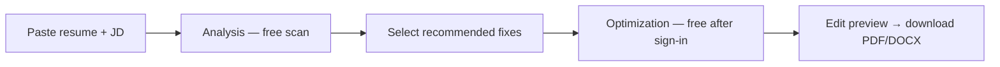

# ResumeAtlas — Product Summary (Analysis + Optimization)

> **Session rule:** Read all files in `/ai-context` before making product, copy, SEO, billing, or analytics changes.

**Related:** `product-rules.md` (boundaries & evidence rules) · `productBenefits.ts` (canonical benefit strings) · `architecture.md` (pipelines)

---

## What ResumeAtlas is

ResumeAtlas helps job seekers **decide whether to apply** and **increase shortlist odds** for a **specific job posting** — not generic resume scoring.

**Core promise:** *Know if you're ready to apply before you apply.*

Users paste **resume + job description** (text, no file upload). The product returns an **apply-readiness intelligence dashboard**, then optionally a **job-specific optimized resume**.

ResumeAtlas sells **both** apply-readiness **analysis** and **job-specific optimization**. Never position as analysis-only.

---

## Two-phase pipeline



| Step | Cost | Auth required |
|------|------|---------------|
| Paste resume + JD | Free | No |
| Intelligence dashboard (full) | Free (1 scan / 30 days) | No |
| Optimization | Free after Google sign-in | Yes |
| PDF / DOCX download | Paid (starter pack on free path) | Yes |

**Free tier one-liner:** Free scan · free optimize after sign-in · pay only to download.

---

## Phase 1 — Analysis (apply-readiness intelligence)

The free analysis dashboard answers: *Should I apply to this job as-is, and what would block me?*

### Metrics and outputs

| Output | What it tells the user |
|--------|-------------------------|
| **Application verdict** | Apply now, optimize first, or skip — with **estimated shortlist odds** (~X% if you apply today, ~Y% after optimize) |
| **Role fit for this posting** | Fit verdict for the target title plus related roles you may also qualify for |
| **Elimination / rejection risks** | Top reasons a recruiter or ATS might skip this application for this posting |
| **Skill proof map** | Which JD skills are **proven in project bullets** vs **listed only** in the skills section |
| **Keyword coverage score** | ATS keyword match — which posting terms are matched vs missed (shown as %) |
| **Recommended fixes** | Selectable coaching actions tied to rejection risks and skill gaps — user chooses what Optimize applies |

### Scan summary (at-a-glance counts)

The dashboard aggregates three headline counts:

| Count | Meaning |
|-------|---------|
| **Critical risks** | Elimination issues actively hurting interview odds |
| **Recommended fixes** | Targeted improvements available for this role |
| **Keyword coverage %** | Share of JD keyword set covered in the resume |

### Shortlist odds model

- **Current shortlist %** — estimated odds with the resume as written
- **Projected shortlist %** — estimated odds after applying selected fixes
- **Uplift** — delta between current and projected (shown in gauges, align card, and analysis report)

Verdict tier derives from shortlist %: strong (≥72), good (≥55), cautious (≥40), poor (&lt;40).

Inputs include keyword proof % and rejection-risk count. Source: `app/lib/applicationVerdict.ts`.

### Workbench modes

Same workbench (`HomeClient.tsx`), different emphasis:

| Mode | JD required | Dashboard focus |
|------|-------------|-----------------|
| **JD match** (primary) | Yes | Full verdict + skill proof + fixes |
| **ATS compliance** | Optional | Format / parsing signals |
| **Keyword scanner** | Yes | Keyword coverage + skill gaps |

Primary workbench URL: `/check-resume-against-job-description`

---

## Phase 2 — Optimization (job-specific rewrite)

Optimization is **user-consented and fix-driven**. The user selects **recommended fixes** on the dashboard, then runs optimize. The AI applies **only what the user selected** — not random keyword stuffing across the whole resume.

### Five optimization benefits

| Benefit | What changes |
|---------|--------------|
| **JD-tailored summary** | Professional summary rewritten for this posting's domain, focus, and role fit |
| **Listed-only → proven** | Skills that appeared only in the skills section are demonstrated in project bullets with concrete experience language |
| **Selected rejection fixes** | Each selected elimination-risk fix is addressed in the strongest matching bullets to improve shortlist odds |
| **Impact quantification** | Weak bullets refined with goal/outcome metrics (% faster, users served, scale, latency, revenue pipeline, etc.) when it strengthens proof |
| **Edit, then download** | User reviews every change in an editable UI on `/optimize`, then exports application-ready **PDF and DOCX** |

### Optimization impact metrics (UI)

Before and after the optimize run, users see:

- **Current shortlist odds → projected shortlist odds**
- **Uplift** (e.g. 42% → ~58%, +16)
- **Before/after bullet previews** illustrating stronger impact and proof

Components: `OptimizeAlignMetrics`, `OptimizeAlignCard`, `AnalysisReportCard`, `ShortlistGauge`.

### Evidence rules (how the AI behaves)

From `app/lib/optimizePrompts.ts` (`REWRITE_EVIDENCE_RULES`):

- Demonstrate every **assigned skill or user-selected fix** as work performed: action + tool/method + deliverable + outcome
- **May** name JD-aligned tools/methods when project context supports that type of work
- **May** add plausible round metrics when source bullets lack numbers
- **Must not** move work across companies, projects, or domains
- **Must not** apply fixes the user did not select
- Rejection-oriented skills (from selected fixes) may receive **constructed demonstrated experience** in bullets — intentional and user-initiated, not blanket invention

### What optimization is NOT

- Not a generic resume builder or template designer
- Not random keyword injection across the whole resume
- Not automatic fabrication of every missing JD skill — only **user-selected fixes** and **assigned weak keywords** from the optimize run

Optimize workspace URL: `/optimize` (noindex)

---

## How analysis + optimization differ from keyword-only tools

Most ATS checkers stop at a keyword percentage or generic score. ResumeAtlas combines:

1. **Decision support** — apply / optimize / skip with estimated shortlist odds
2. **Proof diagnosis** — proven vs listed-only skills, elimination risks
3. **Targeted rewrite** — only user-selected fixes, tied to this JD
4. **Export-ready output** — editable preview → PDF/DOCX for the application

Lead with **apply-readiness** and **shortlist odds**, not ATS score alone.

---

## User funnel (product view)

```
SEO / marketing page
    → /check-resume-against-job-description  (primary workbench)
    → Analyze (free)
    → Dashboard + select recommended fixes
    → Sign in with Google (for optimize)
    → /optimize  (free preview + edit)
    → Download PDF/DOCX  (payment on free path)
```

**Marketing homepage (`/`):** scroll funnel — CTAs push to the workbench.  
**Money page:** `/check-resume-against-job-description`

---

## Key UI components (dashboard)

| Component | Role |
|-----------|------|
| `IntelligencePanel` | Dashboard shell |
| `EvidenceIntelligenceSection` | Verdict, metrics, skill proof, fixes |
| `ApplicationIntelligenceDashboard` | Scan summary counts + impact panel |
| `RoleFitVerdictSection` | Role fit for target + related roles |
| `TopRejectionRisksSection` | Elimination risks |
| `SkillProofMapSection` | Proven vs listed-only skills |
| `RecommendedFixesSection` | Fix selection (drives optimize) |
| `OptimizeAlignCard` | Shortlist uplift + optimize CTA |
| `ResumeOptimizationPanel` | Edit + download on `/optimize` |

---

## Canonical copy sources

| Concern | File |
|---------|------|
| **Analysis + optimization benefit strings** | `app/lib/productBenefits.ts` |
| Product boundaries & evidence rules | `ai-context/product-rules.md` |
| Metric labels & CTA copy | `app/lib/evidenceMetricCopy.ts` |
| Optimize LLM prompts | `app/lib/optimizePrompts.ts` |
| Recommended fixes generation | `app/lib/recommendedFixes.ts` |
| Application verdict logic | `app/lib/applicationVerdict.ts` |
| Home marketing copy | `app/lib/homeMarketingContent.ts` |

---

## Positioning one-liners

**Product value:** Free apply-readiness analysis, then free job-specific optimization after sign-in — pay only to download PDF or DOCX.

**Pipeline:** Analyze fit → select fixes → optimize for this job → edit → download the version you send.
