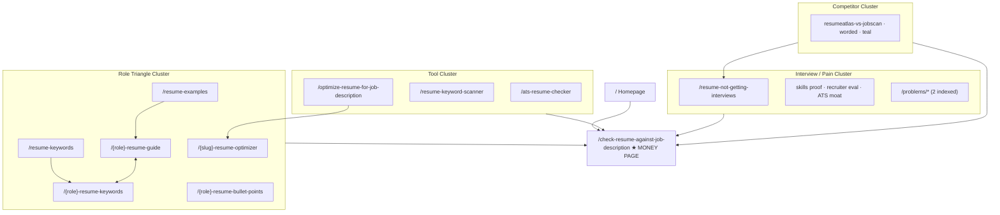

# ResumeAtlas — SEO Structure

> **Session rule:** Read all files in `/ai-context` before making product, copy, SEO, billing, or analytics changes.

**Domain:** https://resumeatlas.io  
**Sitemap:** https://resumeatlas.io/sitemap.xml — **68 indexed URLs**  
**Robots:** `public/robots.txt` — `Allow: /` (indexing controlled per-page via metadata)  
**Blog:** None — programmatic SEO + tool landings only

---

## Positioning for Google

### Primary SERP angle

ResumeAtlas targets **"compare resume to job description"** and **"optimize resume for job description"** with a dual value prop: **apply-readiness analysis** plus **job-specific optimization** — not just ATS keyword scores.

| Layer | Message |
|-------|---------|
| SEO title (Layer 1) | Compare resume to job description · ATS score · gaps |
| Product truth (Layer 2) | Application verdict · elimination risks · skill proof · shortlist odds |
| Conversion CTA | Free scan → free optimize → pay to download |

**Homepage title:**  
`Compare Resume to Job Description | ATS Score, Gaps & Apply Readiness | ResumeAtlas`

**Target keyword buckets:**

| Intent | Canonical owner | Example queries |
|--------|-----------------|-----------------|
| Resume ↔ JD compare | `/` + `/check-resume-against-job-description` | compare resume to job description |
| ATS checker | `/ats-resume-checker` | ats resume checker |
| Keyword scanner | `/resume-keyword-scanner` | resume keyword scanner |
| Role examples | `/{role}-resume-guide` | data analyst resume example 2026 |
| Role keywords | `/{role}-resume-keywords` | software engineer resume keywords |
| Interview silence | interview cluster | resume not getting interviews |
| Competitor alternatives | `/resumeatlas-vs-*` | jobscan alternative |
| Optimize / tailor | `/optimize-resume-for-job-description` | optimize resume for job description |

**Freshness:** Titles include `2026` (`CONTENT_FRESHNESS_YEAR` in `app/lib/searchIntentSeo.ts`).

---

## Authority pages (tier hierarchy)

### Tier 1 — Top authority (sitemap priority 1.0)

| URL | Role |
|-----|------|
| `/` | Brand + discovery; role browse clusters |
| **`/check-resume-against-job-description`** | **Primary money page** — tool execution, conversion anchor |

All clusters CTA back to: `/check-resume-against-job-description#ats-checker-form`

### Tier 2 — Cluster cores (priority 0.9)

| URL | Role |
|-----|------|
| `/resume-not-getting-interviews` | Interview-silence hub |
| `/ats-score-vs-real-job-fit` | Moat: keyword match ≠ interview readiness |

### Tier 3 — Cluster spokes (priority 0.8)

Tool cluster, guide hubs, interview spokes, competitor pages, indexed problems, methodology.

### Tier 4 — Role pillars (priority 0.65)

Per-role guides, keywords, bullet hubs, optimizers.

---

## Sitemap inventory (68 URLs)

| Cluster | Count | Paths |
|---------|-------|-------|
| Home + primary tool | 2 | `/`, `/check-resume-against-job-description` |
| Tool cluster | 2 | `/ats-resume-checker`, `/resume-keyword-scanner` |
| Optimize hub + role optimizers | 11 | `/optimize-resume-for-job-description` + 10 `/{slug}-resume-optimizer` |
| Guide cluster | 4 | `/ats-resume-template`, `/resume-guides/resume-work-experience-examples`, `/resume-guides/resume-skills-examples`, `/customize-resume-without-lying` |
| Hub indexes | 2 | `/resume-examples`, `/resume-keywords` |
| Core role guides + keywords | 20 | 10 roles × (`-resume-guide`, `-resume-keywords`) |
| Bullet point hubs | 5 | `/{role}-resume-bullet-points` |
| Pilot / alt keyword pages | 5 | data-engineer, sql-developer, power-bi, systems-analyst, business-intelligence |
| Interview / pain cluster | 7 | 5 interview guides + 2 indexed `/problems/*` |
| Competitor comparisons | 3 | vs jobscan, resume-worded, teal |
| Methodology | 1 | `/methodology` |
| Legal / support | 5 | contact, privacy, terms, refund-policy, feedback |
| **Total** | **68** | |

### 10 core roles (`app/lib/seoPages.ts`)

`data-analyst`, `data-scientist`, `software-engineer`, `product-manager`, `business-analyst`, `frontend-developer`, `backend-developer`, `machine-learning-engineer`, `devops-engineer`, `full-stack-developer`

Each has: `/{role}-resume-guide`, `/{role}-resume-keywords`

### 10 role optimizer spokes

`data-scientist`, `data-engineer`, `software-engineer`, `business-analyst`, `product-manager`, `machine-learning-engineer`, `ai-engineer`, `analytics-manager`, `devops-engineer`, `backend-engineer`

---

## Pages NOT in sitemap

| Path | Reason |
|------|--------|
| `/optimize` | App workspace — noindex |
| `/tools` | Internal hub — noindex |
| `/faq` | Support — noindex, follow |
| `/problems` hub | noindex |
| `/resume-guides` | 308 → `/ats-resume-template` |
| 8 of 10 `/problems/{slug}` | noindex (cannibalization guard) |
| Supplementary orphans | `/data-analyst-interview-questions`, `/data-analyst-cover-letter-example`, `/business-analyst-vs-data-analyst-resume` |

---

## Topic cluster architecture



### Role triangle (per role)

From `app/lib/roleClusterLinks.ts`:

```
/{role}-resume-guide  ↔  /{role}-resume-keywords  ↔  /resume-examples (hub)
         ↓
/check-resume-against-job-description
```

### Interview cluster

Hub: `/resume-not-getting-interviews`  
Spokes: skills proof, recruiter evaluation, ATS score moat, competitor light-links  
All CTA → workbench

### Anti-cannibalization policy

| Rule | Implementation |
|------|----------------|
| One intent per URL | `canonicalIntentClusters.ts` |
| Thin legacy routes 301'd | `/{role}`, `/{role}/keywords/*`, `/{role}/resume/*` → pillars |
| Only 2 problem pages indexed | `INDEXED_PROBLEM_SLUGS` in `problemPages.ts` |
| Semantic related links | 6–8 per page via `internalLinks.ts` |

---

## Technical SEO

| Element | Location |
|---------|----------|
| Sitemap generator | `app/sitemap.xml/route.ts` |
| Entry builder | `app/lib/sitemapEntries.ts` |
| Global metadata | `app/layout.tsx` (metadataBase, Organization + WebSite JSON-LD) |
| Per-page metadata | `export const metadata` or `generateMetadata()` |
| Structured data | `WebApplication`, `FAQPage`, `BreadcrumbList`, `Article`, `ItemList` |
| GSC verification | Meta tag in root layout |
| Legacy sitemap aliases | `/sitemap-resume.xml`, `/sitemap-keywords.xml` → `/sitemap.xml` |

### JSON-LD sources

- `app/lib/homeJsonLd.ts`
- `app/lib/postingFitJsonLd.ts`
- `app/lib/roleOptimizerJsonLd.ts`
- `app/lib/resumeExampleSeoTemplate.ts`

### EEAT signals

- `/methodology` — scoring methodology
- Honest ATS disclaimers on problem pages
- `CONTENT_LAST_UPDATED_LABEL = "April 2026"`

---

## Homepage vs workbench split

| URL | Purpose |
|-----|---------|
| `/` | Marketing scroll funnel — CTAs to workbench |
| `/check-resume-against-job-description` | Interactive tool — analyze + optimize entry |

Defined in `app/lib/internalLinks.ts` (`CHECK_RESUME_AGAINST_JD_PATH`).

---

## Redirect volume

`next.config.mjs` contains ~600 lines of SEO redirects consolidating thin programmatic routes to canonical pillars. `middleware.ts` handles additional legacy `/seo/*` and `/resume-guides/*` patterns.

---

## SEO copy gap (known)

Optimization benefits are **underrepresented** in current marketing/SEO copy. When updating landing pages, lead with:

1. JD-tailored summary
2. Listed-only skills → demonstrated in bullets
3. User-selected rejection fixes applied
4. Impact quantification
5. Editable preview + PDF/DOCX export

See `ai-context/product-rules.md` for full product truth.

---

## Key files

| Concern | File |
|---------|------|
| Sitemap | `app/lib/sitemapEntries.ts` |
| Canonical clusters | `app/lib/canonicalIntentClusters.ts` |
| Role taxonomy | `app/lib/seoPages.ts` |
| Hub pages | `app/lib/seoHubPages.ts` |
| Internal links | `app/lib/internalLinks.ts` |
| Role clusters | `app/lib/roleClusterLinks.ts` |
| Interview cluster | `app/lib/interviewCluster/` |
| Problem pages | `app/lib/problemPages.ts` |
| Tool landings | `app/lib/toolClusterPages.ts` |
| Home SEO | `app/lib/homePageSeo.ts` |
| Redirects | `next.config.mjs`, `middleware.ts` |
